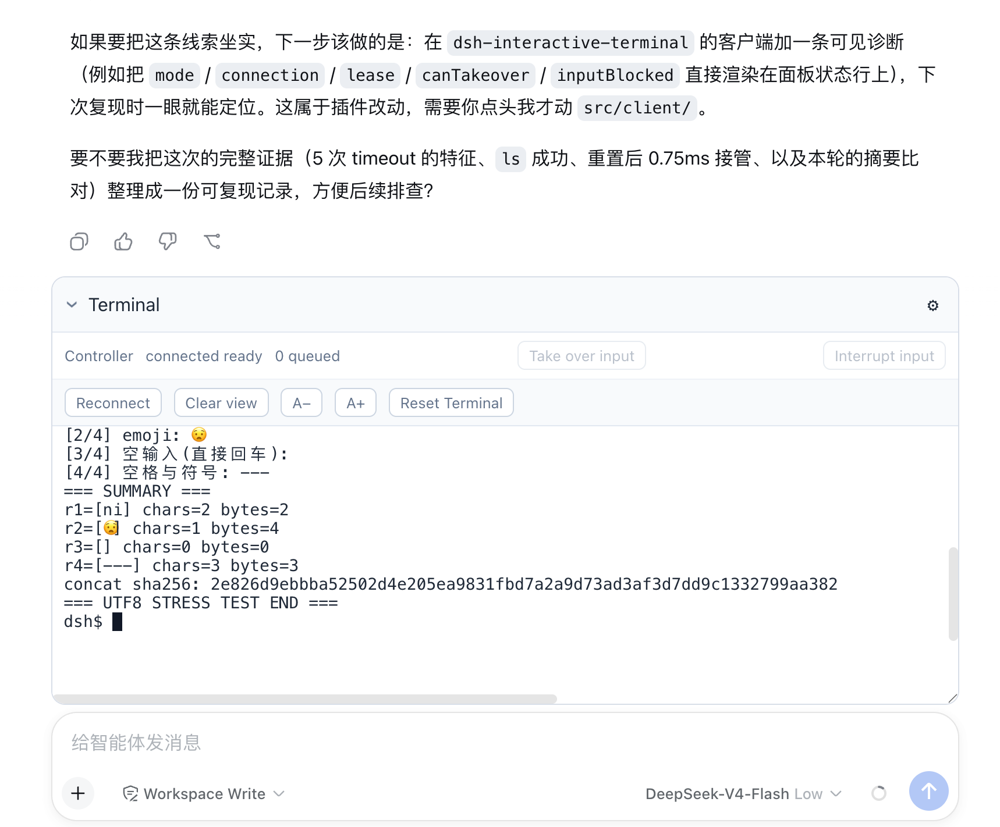

# dsh-interactive-terminal

English | [中文](README.zh.md)

A persistent Bash terminal shared by the model and the user in DeepSeek Harness Web. Each live Agent owns one PTY, rendered with xterm.js above the composer. The model can run terminal tools, and a human can continue the same interactive process without starting a separate shell.



> A connected Controller view after human input completed a four-round UTF-8 interaction started by the model.

## Quick start

Requirements: macOS or Linux, Bash, Node.js `^22.19 || >=24`, and pnpm on `PATH`. Version `0.1.0` is tested with DSH `0.1.0-rc.8` and pnpm `10.18.3`.

```sh
npm install -g @deepseek-ai/dsh@0.1.0-rc.8 pnpm@10.18.3
dsh plugin --profile web add dsh-interactive-terminal@0.1.0
dsh --profile web
```

Open the URL printed by DSH, configure a model if needed, select a workspace and conversation, and click **Open terminal**. Type `echo hello` at the idle prompt to verify browser input. Later launches only need:

```sh
dsh --profile web
```

## Installation

### Load the npm package with an installed DSH CLI

```sh
dsh plugin --profile web add dsh-interactive-terminal@0.1.0
dsh --profile web
```

The plugin command installs the package into the Web profile and activates its bundled `cordis.patch.yml`; no additional `--patch` is needed. Installing the package globally with `npm install -g` does not activate it in DSH.

Installation and startup must use the same `DSH_HOME`, whose default is `~/.dsh`. Restart an already running DSH after adding or updating the plugin. If pnpm reports that no versions are available, verify that the profile uses the public registry:

```sh
cd "${DSH_HOME:-$HOME/.dsh}/profiles/web"
pnpm config set registry https://registry.npmjs.org/ --location=project
```

### Load the npm package from a DSH source checkout

Use the DSH tag supported by this plugin, then run the repository's source CLI:

```sh
git clone --branch dsh-v0.1.0-rc.8 --depth 1 https://github.com/deepseek-ai/deepseek-harness.git
cd deepseek-harness
pnpm install
pnpm dsh plugin --profile web add dsh-interactive-terminal@0.1.0
pnpm dsh --profile web
```

The first `pnpm dsh` is the source equivalent of the installed `dsh` command. The profile remains under the same `DSH_HOME`, so later source launches only require the final command.

### Install from the plugin source

```sh
git clone https://github.com/mingzhicode/dsh-interactive-terminal.git
cd dsh-interactive-terminal
pnpm install
pnpm run build
dsh plugin --profile web add "$PWD"
dsh --profile web
```

The profile loads the local checkout's built `lib/` and `dist/` files. After changing the plugin source, rebuild it and restart DSH. When using a DSH source checkout, run `pnpm dsh` from that repository and pass this plugin's absolute directory to `plugin add`.

### Install a downloaded npm tarball

```sh
dsh plugin --profile web add ./dsh-interactive-terminal-0.1.0.tgz
dsh --profile web
```

The tarball contains the host and browser builds and has no build-on-install or `postinstall` step. Its dependencies may still require registry access. Download a published tarball separately with `npm pack dsh-interactive-terminal@0.1.0`.

## Interaction flow

1. Click **Open terminal**. The first expansion or Agent tool call lazily creates that Agent's shell.
2. Confirm the status begins with **Controller**. At an idle prompt, type directly; the first key requests human input ownership and later keys wait for the grant.
3. Let the model call `shared_terminal_send` to start a program. While the model operation owns the queue, ordinary typing is ignored instead of becoming a later shell command.
4. When that program asks for input, click **Take over input** and wait for the grant before typing. The handoff preserves the process, sends no signal, and removes the model operation's deadline.
5. Continue entering text, Enter, emoji, or other UTF-8 input in the same PTY. Enter submits input but does not release ownership; a verified shell prompt or process exit completes the interaction. After every human interaction completes—whether started at an idle prompt or through takeover—the plugin directly notifies the Agent so it can read the terminal and continue.
6. Use **Interrupt input** to send `SIGINT` to the re-inspected foreground process group. This interrupts the program and retains ownership until prompt recovery; it is not an input handoff.

The settings menu provides **Reconnect**, local **Clear view**, text-size controls, and a confirmed **Reset Terminal**. Collapsing the panel, clearing the view, or reconnecting does not end the shell. Resizing the panel does not change the fixed PTY rows and columns. Host disposal closes the panel and clears the local renderer and unsent input; temporary disconnections reconnect automatically.

Only one browser view controls an Agent's terminal. Additional views and all mobile views are read-only. **Take over input** transfers the model's current queue operation to the browser Controller; it does not take browser control away from another view. If the header says **Read only**, close the controlling view, wait for `disconnectGraceMs`, then use **Reconnect**.

## Configuration

Add an override to `~/.dsh/profiles/web/cordis.patch.yml`, or `$DSH_HOME/profiles/web/cordis.patch.yml` when using a custom home:

```yaml
- id: dsh-interactive-terminal
  config:
    shellPath: /bin/bash
    shellArgs: [--noprofile, --norc, -i]
    rows: 40
    cols: 160
```

The patch replaces this entry's complete `config`; include every custom value you want to retain. Omitted fields use the defaults below.

Configuration is resolved when the plugin loads. After editing the patch, restart DSH so the new values take effect. **Reset Terminal** destroys the current shell and creates a new generation with the configuration already loaded in memory; it does not reread the YAML file.

| Field | Default | Effect |
| --- | ---: | --- |
| `shellPath` | `/bin/bash` | Bash executable; other shells are rejected. Applied when a terminal generation is created. |
| `shellArgs` | `--noprofile --norc -i` | Interactive-shell arguments; empty arguments are rejected. Applied at shell spawn. |
| `rows` | `40` | Fixed PTY rows for every new generation. |
| `cols` | `160` | Fixed PTY columns for every new generation. |
| `scrollbackLines` | `10000` | Retained history lines, excluding the viewport. Applied to host snapshots and the browser renderer. |
| `scrollbackMaxBytes` | `4194304` | UTF-8 limit for serialized ANSI history, excluding the viewport. |
| `maxToolOutputBytes` | `262144` | Complete tool-result JSON limit; at least `1024` and no greater than `scrollbackMaxBytes`. |
| `maxInputBytes` | `65536` | Input bytes per model send or accepted human input lease. |
| `maxQueuedOperations` | `128` | Accepted mutations per Agent, including the active operation. |
| `maxSessions` | `32` | Maximum number of live Agent terminals. |
| `pollIntervalMs` | `50` | Delay from one foreground-process check to the next. |
| `operationTimeoutMs` | `30000` | Model mutation deadline before interrupt recovery starts. |
| `interruptTimeoutMs` | `5000` | Controlled-prompt recovery deadline after `SIGINT`. |
| `disconnectGraceMs` | `15000` | Controller reconnect grace before active human input is recovered and released. |
| `disposeGraceMs` | `3000` | Process-tree termination grace during reset or teardown. |

## Design

### Terminal ownership and lifetime

- A terminal belongs to the exact live Agent, not to a browser tab or tool call. It is created lazily on first UI expansion or tool use in that Agent's workspace and sandbox policy.
- Panel collapse and authenticated reconnect retain the same shell. A reconnect restores a bounded screen snapshot before live output and validates generation and output sequence.
- One browser socket is the Controller. A private reconnect proof can resume it during `disconnectGraceMs`; other desktop views and all mobile views are read-only.
- Reset terminates the current process tree and creates a new generation. Agent disposal, plugin unload, and HMR revoke browser connections and terminate the owned process tree. A natural shell exit retains its final screen until reset.

### FIFO queue, handoff, and recovery

- Model sends, human input leases, signals, and resets share one strict FIFO mutation queue per Agent. Acceptance order determines execution order; `shared_terminal_read` bypasses input ownership.
- A granted model send may be handed to the Controller in place. Handoff keeps the active queue slot, clears its model timeout, returns `waitReason: human_handoff` to the model, and leaves later operations queued.
- A prompt, an observed foreground `stdin_read`, or process exit completes the active operation. macOS DSH `rc.8` does not report `stdin_read`, so interactive prompts require explicit handoff before `operationTimeoutMs` expires.
- Model timeout or cancellation sends `SIGINT` to a freshly inspected foreground process group and holds the queue through prompt recovery. If recovery misses `interruptTimeoutMs`, the queue becomes blocked; only the earliest accepted reset may replace it.
- Queue length, input bytes, retained output, tool JSON, and live Agent terminals are bounded by configuration. Output snapshots retain the newest valid UTF-8 suffix when truncated.

## Agent tools

All tools address the executing Agent's terminal. A caller cannot choose another Agent, PTY, working directory, shell, environment, or sandbox.

| Tool | Behavior |
| --- | --- |
| `shared_terminal_send({ text, submit? })` | Queue model input. `submit` defaults to `true` and appends Enter. Returns on prompt, observed `stdin_read`, human handoff, exit, or timeout/cancellation recovery. |
| `shared_terminal_read({ offset?, count? })` | Read the viewport and a newest-relative history page without acquiring input ownership. `offset` skips lines from the newest end; `count` selects preceding lines. |
| `shared_terminal_signal({ signal })` | Queue `SIGINT`, `SIGTERM`, `SIGKILL`, `SIGTSTP`, or `SIGHUP` for the re-inspected foreground process group. `SIGKILL` of the top-level shell is refused. |
| `shared_terminal_reset({})` | Queue process-tree teardown and a fresh shell generation; also replaces a naturally exited shell. |

Results include generation, output sequence, geometry, viewport, cursor, process and queue status, holder, pending count, and truncation state. Mutations add queue time and `waitReason`; send and signal add captured operation output. Reads add `text`, `lineBegin` (inclusive), `lineEnd` (exclusive), and `totalLines`. Cursor coordinates are zero-based.

`waitReason: human_handoff` means the human owns a still-running interaction, not that the command completed. The model must wait instead of submitting an answer behind that lease. A timeout likewise does not prove that the foreground process exited.

## Recovery and limits

- `queue is blocked until reset`: interrupt recovery missed its deadline. Wait for the earliest accepted reset; later mutations are rejected.
- `terminal queue is full`: wait for accepted operations instead of retrying in parallel.
- `terminal capacity reached`: dispose an Agent or finish pending cleanup before increasing `maxSessions`.
- A rejected browser write requires explicit **Reconnect**. Controller disconnect recovery remains subject to `disconnectGraceMs`.
- `TERM=dumb`, fixed geometry, and `PAGER=cat` are intentional. Full-screen or terminal-query-dependent TUIs are unsupported; the browser suppresses generated query replies and the Host has no query responder.
- Linux can yield on an observed foreground stdin wait, but Linux native validation and multi-round REPL validation remain outstanding.

## Security

The Host decides terminal identity, working directory, and sandbox policy. When confinement is required, unavailable confinement fails startup rather than falling back to unconfined execution. The shell does not inherit Harness credentials.

Browser attachment uses hashed, Agent-bound, single-use tokens valid for ten seconds. The WebSocket accepts no caller-selected Agent, Session, or PTY identifier. Raw terminal output and human keystrokes are not session events; model tool arguments and bounded results are logged normally.

Custom subprocess providers must re-inspect the foreground process group when delivering a signal and refuse top-level shell `SIGKILL`, as the official DSH `rc.8` provider does.

## Development and packaging

```sh
pnpm install
pnpm run build
npm pack --dry-run
npm pack
```

The generated `.tgz` can be installed with the tarball command above. For isolated verification, set `DSH_HOME` to a fresh directory before both installation and startup. The keyless Web tests use a replay model with a real Agent loop and native PTY; they are not a live-model test.

Build and verification do not publish. Before publishing manually, run release checks, inspect the package contents, and confirm the npm account, registry, version, and explicit publishing authorization. Never place credentials in the repository or logs.

## License

MIT. See [LICENSE](LICENSE).
